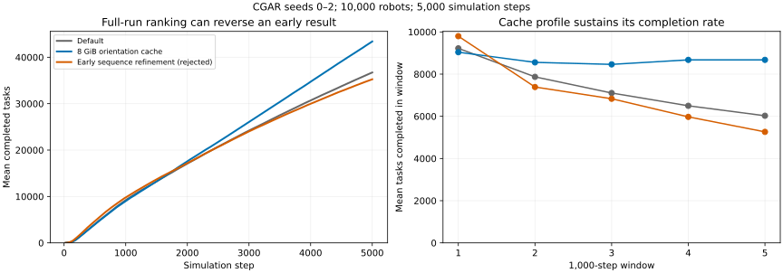
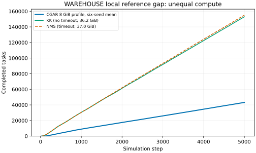

# WAREHOUSE: full-run cache and action-sequence study

The confirmed improvement is an optional generic orientation-cache profile. Across six planner seeds on the complete **10,000-robot, 5,000-step WAREHOUSE** instance, it increases mean completions from **36,804 to 43,176**, or **17.3%**. It also improves on the previous 512 MiB demand-cache profile by a mean **6.1% paired change**. The recommended configuration uses neither action-sequence refinement nor pre-rotation.

```sh
CGAR_ORIENTATION_GUIDANCE=1 CGAR_TURN_FIRST=1 CGAR_TURN_TABLE_MB=8192
```

The clean final six-seed batch takes **176–180 seconds per full run** on one reserved physical core and peaks at **14.3 GiB RSS** for this profile, below the requested **32,000,000,000-byte** target. Default CGAR takes 123–126 seconds in the same batch. A preceding batch on another CPU model took 227–240 seconds for the cache profile; this is not a controlled cross-build speed comparison. These timings exclude queue delay and separate analysis. Full runs, with independent seeds and profiles in parallel, are now the iteration benchmark. Slower sequence prototypes are reported with their actual runtimes.

[All scores and resource measurements](RESULTS.md), [per-seed comparisons](results/cache-paired.json), [run ledger](results/study.json), [complete compact records](results/all-full-runs.json).

## What improved

`CGAR_TURN_TABLE_MB` exposes the capacity of the existing exact orientation-distance cache; its default remains 512 MiB. The 8 GiB LRU profile guides about 98.9% of eligible PIBT calls across the full run, including initial warmup, avoiding most spatial fallback. It retains the existing fixed limit on complete distance-table builds per decision. The primary, spatial progress potential, recovery witnesses, task scheduling, and ordinary movement commitments remain in place.

The previous profile used demand-based admission (`CGAR_ORIENTATION_GUIDANCE=2`), while the new profile uses LRU (`=1`). Thus the 6.1% comparison changes both cache capacity and admission policy. The separate [cache-policy matrix](results/warehouse-cache-policy-full-v13/) holds each factor explicitly: larger demand caches are not automatically better. The capacity and admission policy are global parameters; no map names, warehouse aisle rules, supplied map weights, or category-specific fleet limits are introduced.

Raising the LRU capacity from 8 to 20 or 24 GiB produces **identical complete trajectories on all three tested seeds**. The larger caches reduce rebuild work but do not improve throughput; total peak RSS rises to about 18.7 GiB. The 4 GiB LRU profile averages 43,296.5 tasks across six seeds, only 0.28% above the 8 GiB mean, and wins on four seeds. It uses about 10.4 GiB total RSS but takes 235–255 seconds versus 159–183 seconds for 8 GiB in the two matched batches. We retain 8 GiB as the faster iteration profile; we treat their throughput as near-tied on these six seeds. A capacity is a cache limit, not a guarantee on the whole process's memory usage. [Memory matrix](results/warehouse-memory-full-v4/), [trajectory comparisons](results/trajectory-equivalence.json).

The improvement is sustained late in the run. Default CGAR loses completion rate as the run continues; the cache profile remains near its initial rate. Early prefixes can reverse the final ranking: the original sequence refinement initially looked better, while the larger cache initially looked worse.



The figure compares means for seeds 0–2, the seeds shared with the early sequence experiment.

## Comparison with the archived leading submissions

The local full-run KittyKnight reference completes **152,981 tasks**, with no simulator errors or timeouts. NMS completes **154,981 tasks**, but has one entry timeout at timestep zero and is retained as an **invalid diagnostic run**. CGAR's confirmed mean is about **28.2% of KittyKnight's score**. The throughput gap has not been closed.

These are unequal-compute references: each leader uses 32 logical CPUs / 16 physical cores and a 128 GiB scheduler allocation. The archived evaluation environment lists 32 CPUs and 128 GB of memory. CGAR uses one physical core per instance and our stricter 32 GB memory target. Actual peak RSS is **36.2 GiB for KittyKnight and 37.0 GiB for NMS**, so neither run fits the 32 GB target. They retain their supplied policies and are not official competition scores. NMS's recorded timeout and the memory differences must not be omitted when quoting its score. [Full reference evidence](results/leaders-full/), [archived environment](../../kk/Evaluation_Environment.md).



## What the sequence experiments established

The prototypes use a generic pool of three- or five-action sequences over forward moves, clockwise/counterclockwise turns, and waits. Every accepted joint plan has complete future vertex and edge-swap checks; only the first action executes. Search limits are counts of candidates, blockers, depth and passes. A deadline overrun raises `Timeout`; it never returns a partially searched plan as success. A deterministic, completed repair can retain its feasible seed when no permitted improvement is found.

The initial implementation refines a valid one-step CGAR plan whose remaining steps are waits. It protects primary/recovery actions, then accepts bounded displacement chains only when their summed cost decreases. Its 200-step screen was misleading: five-step refinement gained initially but lost over the complete run. Exact oriented terminal costs, deeper search, multiple blockers, deferred commitments, and warm starts did not establish a winning profile. See every tested setting, including failures, in [RESULTS.md](RESULTS.md).

An independent **Fable 5.1 Max review through Claude Code CLI** identified two actual integration defects in the early prototypes: keeping a primary's action unchanged did not protect the cell it was turning toward, and duplicate future commitments could be resolved in robot-index order rather than CGAR priority order. Version 11 protects live intent targets and publishes unique commitments in priority order. An existing occupant may wait or leave a protected target; a different robot may not enter it. A regression admits a lower-index competitor while a higher-index primary is halfway through its turn. The earlier sequence results are evidence about those flawed prototypes, not evidence that a correct temporal CGAR construction must fail.

Protecting every ordinary commitment for the whole horizon is conservative and can itself choke traffic. Likewise, removing ordinary commitments from a one-step adapter does not establish that commitments are unnecessary in that adapter. The later free-intent variants preserve protected intentions but test ordinary temporal plans separately. The wait-based seed, stationary-turn variants, carry-over plans, and exploratory fixed passes remain experimental hypotheses rather than a liveness proof.

The independent pre-rotation test is a clean negative result: turn in place only when a waiting, uncommitted, unprotected robot strictly decreases its exact oriented distance. It loses to the cache profile on **all six full-run seeds**. Collision safety and an improved local distance do not imply improved fleet throughput. It is excluded from the recommendation.

Version 13 tests a different mechanism: best-first sequence construction in CGAR priority order, displacing only unbuilt robots and preserving protected forward-dependency actions. Ordinary plans publish no persistent commitments. A prescribed candidate/depth bound retains the feasible seed if construction cannot complete a displacement chain; missing the deadline still raises `Timeout`. Version 14 allows the full set of possible vertex/swap blockers within the five-step horizon, instead of the earlier three-blocker cap. Versions 13 and 14 incorrectly freeze failed/wait-only root attempts, turning them into obstacles for later construction. Version 15 leaves stationary ordinary paths movable while protecting completed moving paths; regression cases distinguish the two. The corrected version completes only 777, 29 and 30 tasks for its one-, three- and ten-blocker bounds respectively, compared with 43,446 for the seed-0 cache control. Its integration and bounded construction remain unusable for throughput. The bounded candidate count, objective, candidate pool, and primary/recovery integration still differ from NMS. These construction experiments are recorded separately from cost-descent refinement and do not establish equivalence to NMS's construction.

The [next diagnostic and implementation steps](NEXT.md) separate reference construction from search effort before adding more CGAR variants.

[Unedited Fable review](fable/review.md), [checked findings and qualifications](fable/assessment.md), [CLI model/invocation metadata](fable/metadata.json).

## Validation and provenance

The warehouse matrices contain **122 attempts: 120 valid complete runs, one explicit deadline failure, and one scheduler interruption**. All completed CGAR process measurements fit the 32 GB target. Three additional full WAREHOUSE runs completed before the scope-change cancellation and remain separately archived; historical 200-step screens and the two leader references are not included in these counts.

Full-run trajectory fingerprints include actions, schedules, task events and task definitions. [The clean final build](results/final-validation.json) passes all 12 full runs and stays below 0.403 seconds per recorded decision on its node. Repeated default trajectories match the prior movement study; repeated 8 GiB profiles match across frozen builds and one- versus two-second caps. The memoization optimization also matches all 50 historical 200-step screen trajectories. The latter screen predates the warehouse-only scope change; no new non-warehouse benchmarks were launched afterward. [Equivalence checks](results/trajectory-equivalence.json), [scope change](results/scope-change.json).

One early sequence-plus-cache run exceeded its one-second deadline while building an exact distance table at timestep zero. It is retained as a failure, with no partial score accepted. Subsequent diagnostic sequence matrices explicitly use two seconds per decision. They are not silently treated as one-second competition results. The confirmed cache profile is validated at one second. One already-poor v8 stationary-turn variant was terminated by GRID after 3,601 seconds, exit 137, despite an attempted wall-time extension. Its last logged timestep is 3,910; no partial task count is accepted. The other three completed full runs from that matrix are retained, alongside the scheduler accounting and explicit incomplete-case manifest. [Interruption](results/warehouse-turn-full-v8/interruption.json). Regression tests cover future collisions, rollback, fixed plans, primary target protection across turns, recovery/pocket/capacity constraints, and deterministic fixed-work exploration. Finite tests do not prove starvation freedom for a new planning layer.

Each matrix uses exclusive GRID allocation, distinct physical CPU bindings, and a verified unlimited CPU quota. CGAR remains serial per instance; the parallelism is across independently allocated runs. The scheduler's memory request is per slot and its process address-space limit scales with the whole allocation; it does not impose a separate 16 GiB limit on each child. The report checks measured per-process peak RSS against 32 GB. CPU models and all submission/resource records are retained, so cross-machine runtimes are not presented as controlled speedups.

The active planner retains only the cache-capacity parameter from this study; sequence and pre-rotation code is removed. Frozen prototype patches in [prototypes/](prototypes/) apply against commit `d6be5084f055b2941892e9845b0c20833612d07c` and reproduce the recorded source hashes. They include unsuccessful and superseded implementations. The v7 build failed a newly introduced test expectation; v7b corrected that fixture without changing its planner implementation. [Patch reproduction](results/prototype-reproduction.json), [build hashes and validation](build-provenance/).

## Reproduce

Configure CGAR as described in the repository's [build instructions](../../README.md#build-and-test). Build and test on reserved cores, then submit the full warehouse matrix; both commands require a new output directory:

```sh
python3 experiments/assignment-20260918/build.py --output runs/warehouse-build-new
# Wait for build.json; use that frozen executable and source manifest.
python3 tools/benchmark_matrix.py \
  --output runs/warehouse-full-new \
  --binary runs/warehouse-build-new/lifelong \
  --source-manifest runs/warehouse-build-new/build.json \
  --variants experiments/sequences-20260918/warehouse-recommended-variants.json \
  --seeds 0 1 2 3 4 5 --instances WAREHOUSE \
  --parallel-suites 12 --jobs-per-suite 1 \
  --time-limit-ms 1000 --memory-gib-per-slot 16
```

For the archived prototypes, start from the base commit, apply the corresponding patch, and use the matching variant file and recorded decision cap. The source-manifest runners reject an executable whose hash does not match the manifest. `submit_analysis.py` can queue analysis with `--hold-job` set to the actual submitted job ID. For deliberately slow prototypes, set `benchmark_matrix.py --runtime 02:00:00` at submission instead of relying on an extension to a running job. `collect.py` archives compact evidence from the original local runs; its `--allow-incomplete` option is for ongoing work, not final validation.

`python3 experiments/sequences-20260918/report.py` regenerates numeric tables and checks from the committed compact records. Add `--plots` with matplotlib installed to regenerate the standalone SVG figures. Full logs, binaries and trajectories are excluded from Git. For fresh leader references, first configure/build both `kk/build/lifelong` and `nms/build/lifelong` on reserved cores, then use `warehouse_references.py --output runs/warehouse-leaders-new`; it freezes their source/assets and submits the recorded resource allocation.
